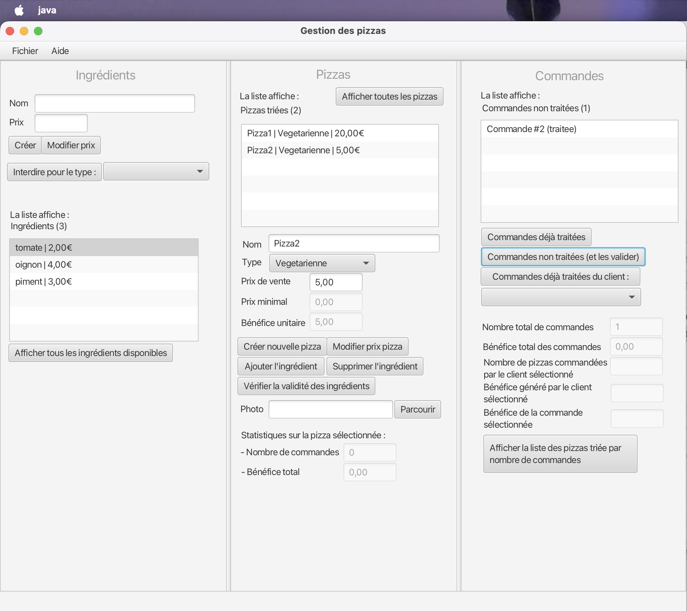
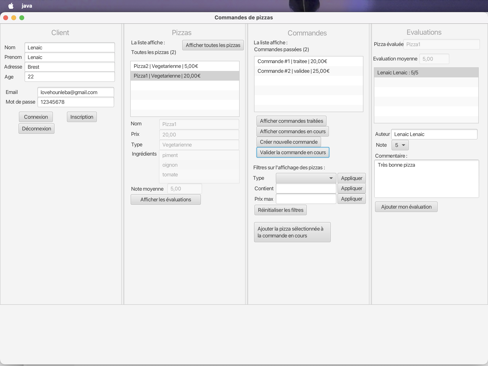

# 🍕 Pizza2Luxe - Java Application for Pizza Creation and Ordering


> Complete Java application (JavaFX) with MVC architecture, real-time order management and data persistence.

---

## 📌 Description

Pizza2Luxe is a Java pizzeria management application allowing a **pizzaiolo** to manage his pizza and ingredient catalog, and **clients** to place orders, track them and rate the pizzas received.

The system is built around **two distinct roles**:

| Role | Rights |
|---|---|
| 👨‍🍳 Pizzaiolo | Create ingredients and pizzas, view and process orders, visualize statistics |
| 👤 Client | Create an account, log in, place orders, view their history, rate pizzas |

The project follows an architecture close to the **MVC** model with a clear separation between business logic (`pizzas/`), graphical interface (`ui/`) and data persistence (`io/`).

---

## 🧩 Simplified Architecture

```
┌─────────────────────────────────────────┐
│           UI - JavaFX (FXML)            │  ← client.fxml / pizzaiolo.fxml
│   ClientControleur / PizzaioloControleur│
└────────────────────┬────────────────────┘
                     │ calls
┌────────────────────▼────────────────────┐
│         Business Interfaces             │
│   InterClient  /  InterPizzaiolo        │
└────────────────────┬────────────────────┘
                     │ implemented by
┌────────────────────▼────────────────────┐
│           Business Logic (Model)        │
│  GestionClient / GestionPizzaiolo       │
│  Commande · Pizza · Client · Evaluation │
│  EtatCommande · TypePizza · Ingredient  │
└────────────────────┬────────────────────┘
                     │ persisted by
┌────────────────────▼────────────────────┐
│         Persistence - io/               │
│   SauvegardePizzeria → pizzeria.dat     │
└─────────────────────────────────────────┘
```

---

## 📸 Application Preview

### 👨‍🍳 Pizzaiolo Interface


### 👤 Client Interface


---

## ⚙️ Tech Stack

- **Language** : Java
- **Graphical Interface** : JavaFX (FXML)
- **Tests** : JUnit (unit and integration tests)
- **Code Quality** : Javadoc · Checkstyle
- **Persistence** : Java Serialization (`pizzeria.dat`)
- **Deliverable** : Executable JAR (`Pizzaiolo.jar`)

---

## 🧠 Main Features

### Client side
- 🔐 Account creation and secure login
- 🍕 Browse the pizza catalog (with filters)
- 🛒 Create and manage orders (add pizzas, validate)
- 📋 View the history of processed orders
- ⭐ Rate pizzas after receiving them

### Pizzaiolo side
- ➕ Create and manage ingredients and pizzas
- 📦 View and process validated orders
- 📊 Sales and profit statistics (per client, per order, global)

### Key business rules
- 🔄 An order follows three strict states: **created → validated → processed**
- ❌ A validated order can no longer be modified
- 📖 Viewing an order by the pizzaiolo automatically marks it as processed
- ⭐ Rating a pizza is only possible after receiving the order
- 🍕 Pizzas have a type (`TypePizza`) that determines the allowed ingredients

---

## 🏗️ Project Architecture

```
pizza2luxe/
├── Projet_Java/
│   └── src/
│       ├── MainPizzas.java              # application entry point
│       ├── pizzas/                      # business logic
│       │   ├── Client.java
│       │   ├── Commande.java            # states, add pizzas, profit
│       │   ├── CommandeException.java   # order business exception
│       │   ├── EtatCommande.java        # enum: creee / validee / traitee
│       │   ├── Evaluation.java
│       │   ├── GestionClient.java       # InterClient interface implemented
│       │   ├── GestionPizzaiolo.java    # InterPizzaiolo interface implemented
│       │   ├── InformationPersonnelle.java
│       │   ├── Ingredient.java
│       │   ├── InterClient.java         # client interface
│       │   ├── InterPizzaiolo.java      # pizzaiolo interface
│       │   ├── NonConnecteException.java
│       │   ├── Pizza.java
│       │   ├── PizzeriaData.java        # global pizzeria data
│       │   └── TypePizza.java           # pizza types enum
│       ├── io/                          # persistence
│       │   ├── InterSauvegarde.java
│       │   └── SauvegardePizzeria.java  # serialization / deserialization
│       ├── tests/                       # JUnit tests
│       │   ├── TestClient.java
│       │   ├── TestCommande.java
│       │   ├── TestInformationPersonnelle.java
│       │   └── TestPizza.java
│       └── ui/                          # JavaFX graphical interface
│           ├── MainInterface.java
│           ├── AppContext.java
│           ├── client.fxml
│           ├── ClientControleur.java
│           ├── pizzaiolo.fxml
│           └── PizzaioloControleur.java
└── javadocs/
    ├── Pizzaiolo.jar
    ├── jvdoc.zip
    └── Plan_de_tests_Pizzeria_Pizza2Luxe.pdf
```

---

## 🚀 Running the Application

### Prerequisites
- Java 17+
- JavaFX SDK (if not globally installed)

### Execution

```bash
# If JavaFX is globally installed
java -jar Pizzaiolo.jar

# If JavaFX is not globally installed
java --module-path <javafx_path>/lib --add-modules javafx.controls,javafx.fxml -jar Pizzaiolo.jar
```

---

## 🧪 Tests

- Unit tests: `TestClient`, `TestCommande`, `TestPizza`, `TestInformationPersonnelle`
- Framework: **JUnit**
- Complete test plan available: `Plan_de_tests_Pizzeria_Pizza2Luxe.pdf`

---

## 🔐 Code Quality

- Complete **Javadoc** documentation (available in `Projet_Java/doc/`)
- **Checkstyle** compliance verified
- Strict adherence to the interfaces imposed by the professor (`InterClient`, `InterPizzaiolo`)

---

## ⚠️ Limits

> Project developed in a group of 3, in an academic context with tight deadlines.

- User interface based on the mockup provided by the professor
- Persistence via Java serialization (no database)
- Application not deployed online (local executable only)

---

## 👥 Team & Contributions

Project carried out in a group of 3 - **group leader: Lenaïc Love HOUNLEBA (responsible for architecture & business logic)**

### 💡 My Main Contribution
- Complete **order** module: `Commande`, `EtatCommande`, `CommandeException` classes, business logic and state transitions
- **Data persistence**: serialization / deserialization (`SauvegardePizzeria`, `PizzeriaData`)
- **JUnit tests**: `TestCommande`, `TestClient`, `TestPizza`, `TestInformationPersonnelle`
- **Checkstyle** application across the entire codebase
- Complete **Javadoc** generation
- Group coordination and contribution integration

---

## 📚 Skills Demonstrated

- Object-oriented programming in **Java**
- Graphical interface with **JavaFX** (FXML, controllers)
- Unit and integration testing with **JUnit**
- Data persistence via **Java serialization**
- **Javadoc** documentation and **Checkstyle** compliance
- Interface design and adherence to an imposed **interface contract**

---

## 👨‍💻 Main Author

**Lenaïc Love HOUNLEBA**  
CEO & Full Stack Developer - [ComeUp](https://comeup.com/fr/@lenaic-1)

🔗 GitHub : [github.com/lenaic-hounleba](https://github.com/lenaic-hounleba)  
📧 lovehounleba@gmail.com

---

> *Project carried out as part of the CA (Application Design) module - L3 Computer Science, Université de Bretagne Occidentale, 2025-2026.*
